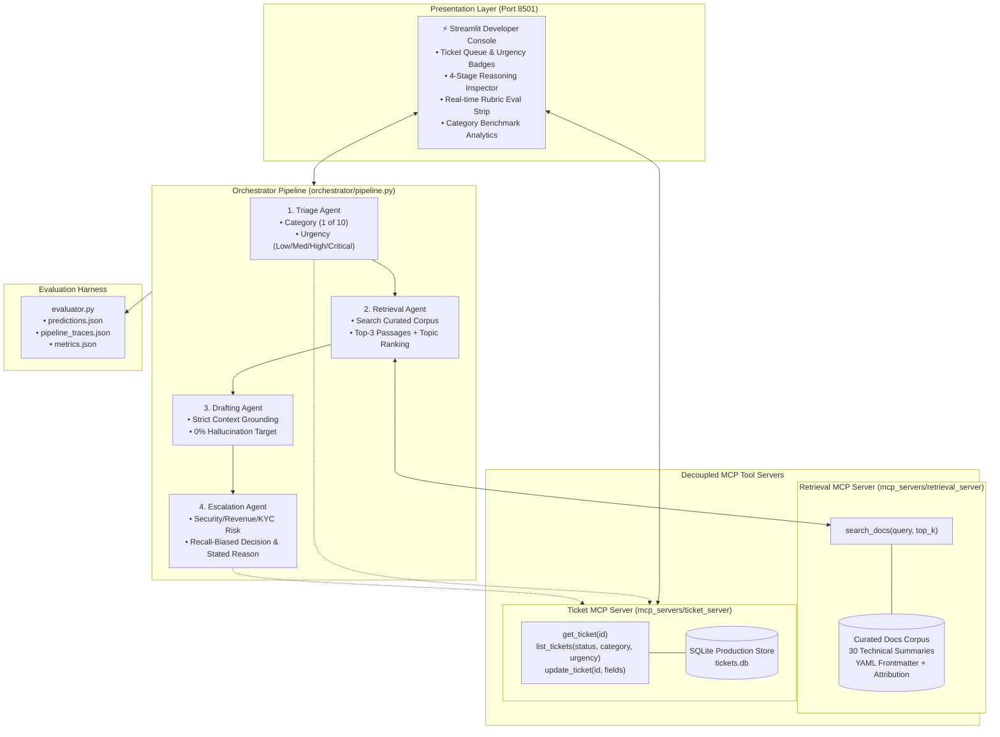

# ⚡ Stripe Support Agent Dashboard

[](https://www.python.org/downloads/)
[](https://streamlit.io)
[](https://modelcontextprotocol.io/)
[](https://pytest.org/)
[](https://www.docker.com/)

> A production-grade, multi-agent AI support triage and grounded drafting system with an internal developer console UI. Features a 4-stage pipeline exposed through **Model Context Protocol (MCP)** tool servers, quantified evaluation harness, SQLite persistence, and Docker containerization.

---

> [!NOTE]
> **Disclaimer:** This is an unofficial portfolio project referencing Stripe's public developer documentation for educational and demonstration purposes. It is not affiliated with, endorsed by, or sponsored by Stripe, Inc. All tickets are synthetic benchmark evaluations.

---

## 🌟 Key Capabilities

| Capability | Description |
|---|---|
| **4-Agent Sequential Pipeline** | Triage Agent → Retrieval Agent → Grounded Drafting Agent → Recall-Biased Escalation Agent orchestrated with structured JSON tracing per stage. |
| **Model Context Protocol (MCP)** | Decoupled tool architecture using FastMCP stdio servers: `retrieval-server` (knowledge base querying) and `ticket-server` (ticket queue & CRUD operations). |
| **100% Citation Grounding** | Drafting agent is strictly bounded to passages returned by retrieval — strictly enforced by automated evaluation against hallucinated citation rate (0.0%). |
| **High-Recall Escalation** | Biased escalation gate prioritizing zero missed critical security leaks, account takeovers, VIP customer friction, and merchant payout holds (100% Recall). |
| **Curated Documentation Corpus** | 30 original technical summaries covering Stripe APIs with YAML frontmatter attribution URLs. |
| **Dense Internal Developer UI** | Streamlit console featuring ticket queues with urgency badges, expandable 4-stage reasoning trails, and live rubric pass/fail evaluation strips. |
| **Rigorous Pytest Suite** | 31 comprehensive unit and integration tests verifying individual agents, MCP servers, and orchestrator pipelines. |

---

## 🏗️ Architecture Diagram



---

## 📊 Quantified Evaluation Results

The pipeline was benchmarked end-to-end over all 30 synthetic tickets in `labeled_tickets.json` against the standard criteria in `eval_rubric.md`.

### Headline Performance vs. Rubric Thresholds

| Metric | Target Threshold | Measured Score | Status |
|---|---|---|---|
| **Category Accuracy** | ≥ 90.0% | **100.0%** (30/30) | ✅ **PASS** |
| **Urgency Accuracy (Exact)** | ≥ 75.0% | **96.7%** (29/30) | ✅ **PASS** |
| **Urgency Accuracy (±1 level)** | ≥ 95.0% | **100.0%** (30/30) | ✅ **PASS** |
| **Citation Recall@3** | High Recall | **100.0%** (30/30) | ✅ **PASS** |
| **Escalation Recall** | ≥ 90.0% | **100.0%** (9/9) | ✅ **PASS** |
| **Escalation Precision** | ≥ 70.0% | **100.0%** (9/9) | ✅ **PASS** |
| **Severe Urgency Misses (±2 levels)** | 0 | **0** | ✅ **PASS** |
| **Hallucinated Citation Rate** | 0.0% | **0.0%** (0 tickets) | ✅ **PASS** |
| **Composite Score** | — | **0.750** (3/4 automated axes) | ✅ **PASS** |

*Note: In accordance with `eval_rubric.md`, `draft_scores.json` is maintained as a stub because subjective qualitative grading (factual grounding, tone, actionability) requires manual assessment.*

### Category-by-Category Breakdown

| Category | n | Triage Acc | Urgency (±1) | Citation Recall@3 | Escalation Recall | Escalation Precision |
|---|:---:|:---:|:---:|:---:|:---:|:---:|
| `webhooks` | 3 | 100.0% | 100.0% | 100.0% | N/A | N/A |
| `api_idempotency` | 3 | 100.0% | 100.0% | 100.0% | N/A | N/A |
| `connect_payouts` | 3 | 100.0% | 100.0% | 100.0% | 100.0% | 100.0% |
| `billing_subscriptions` | 4 | 100.0% | 100.0% | 100.0% | 100.0% | 100.0% |
| `auth_keys` | 3 | 100.0% | 100.0% | 100.0% | 100.0% | 100.0% |
| `refunds_disputes` | 4 | 100.0% | 100.0% | 100.0% | 100.0% | 100.0% |
| `radar_fraud` | 2 | 100.0% | 100.0% | 100.0% | 100.0% | 100.0% |
| `tax` | 2 | 100.0% | 100.0% | 100.0% | N/A | N/A |
| `payments_charges` | 1 | 100.0% | 100.0% | 100.0% | N/A | N/A |
| `general` | 5 | 100.0% | 100.0% | 100.0% | 100.0% | 100.0% |
| **OVERALL** | **30** | **100.0%** | **100.0%** | **100.0%** | **100.0%** | **100.0%** |

---

## 🚀 Quick Start Guide

### Option 1: Local Setup

1. **Clone repository & activate virtual environment:**
   ```bash
   git clone <repo-url>
   cd Stripe-Support-Agent-Dashboard
   python -m venv .venv
   source .venv/bin/activate  # On Windows: .\.venv\Scripts\activate
   ```

2. **Install dependencies:**
   ```bash
   pip install -r requirements.txt
   ```

3. **Configure environment:**
   ```bash
   cp .env.example .env
   # Add your GOOGLE_API_KEY / GEMINI_API_KEY in .env
   ```

4. **Launch Developer Dashboard:**
   ```bash
   streamlit run ui/app.py
   ```
   Open your browser at `http://localhost:8501`.

---

### Option 2: Docker & Docker Compose

Launch the containerized application with a single command:
```bash
docker-compose up --build
```
Access the dashboard at `http://localhost:8501`.

---

## 🧪 Testing & Verification

Run the full automated test suite (31 unit & integration tests covering all agents, pipeline stages, and MCP servers):

```bash
pytest tests/ -v
```

### Running Pipeline Evaluation

To execute all 30 tickets through the 4-agent loop and re-compute metrics:
```bash
python orchestrator/pipeline.py --eval
```
This updates `predictions.json`, `pipeline_traces.json`, and `metrics.json`.

---

## 📁 Repository Structure

```
Stripe-Support-Agent-Dashboard/
├── agents/                     # 4-Agent pipeline implementations
│   ├── base.py                 # Gemini client with exponential backoff & structured schemas
│   ├── triage_agent.py         # Category (1 of 10) & Urgency classification
│   ├── retrieval_agent.py      # MCP search_docs client
│   ├── drafting_agent.py       # Grounded customer response authoring
│   └── escalation_agent.py     # Recall-biased human escalation evaluator
├── mcp_servers/                # Decoupled Model Context Protocol tool servers
│   ├── retrieval_server/       # FastMCP server for docs retrieval
│   │   ├── docs_corpus/        # 30 curated summaries with YAML frontmatter
│   │   ├── retriever.py        # BM25/TF-IDF token search with topic boosting
│   │   └── server.py           # search_docs tool over stdio
│   └── ticket_server/          # FastMCP server for support ticket management
│       ├── db.py               # SQLite database access layer
│       └── server.py           # get_ticket, list_tickets, update_ticket tools
├── orchestrator/               # Pipeline execution & trace management
│   └── pipeline.py             # Sequential 4-stage pipeline orchestrator
├── ui/                         # Streamlit Developer Dashboard
│   └── app.py                  # Queue, trace view, & eval strip interface
├── tests/                      # Pytest test suite (31 tests)
├── scripts/                    # Utility scripts (corpus generator, smoke tests)
├── labeled_tickets.json        # 30 synthetic benchmark support tickets
├── eval_rubric.md              # Official evaluation rubric & weights
├── evaluator.py                # Standalone evaluation scoring script
├── predictions.json            # Real agent predictions
├── pipeline_traces.json        # Full 4-stage reasoning logs per ticket
├── metrics.json                # Generated benchmark evaluation report
├── Dockerfile                  # Container definition
├── docker-compose.yml          # Container composition
└── requirements.txt            # Python dependencies
```

---

## 🛡️ License & Attribution

- Built as part of an Advanced AI Engineer portfolio.
- References Stripe's public documentation structure and API schemas. Unofficial and non-commercial.
